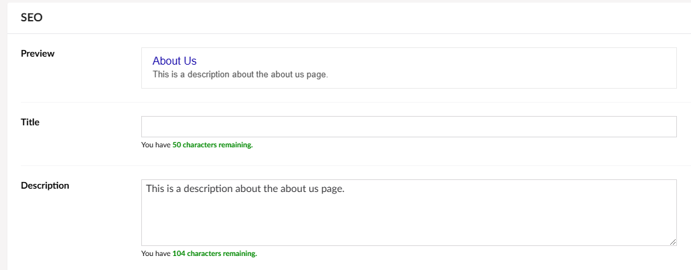
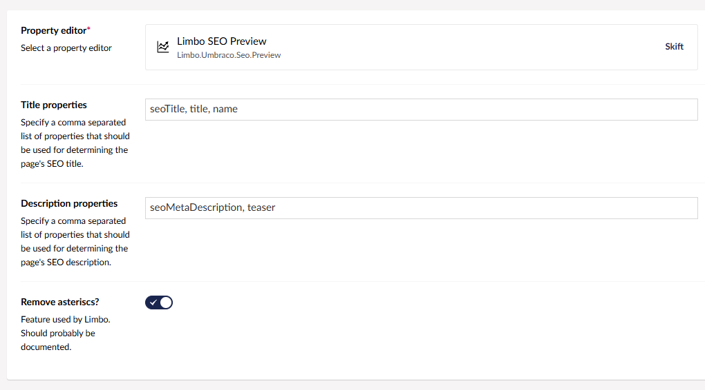

# SEO Preview

**SEO Preview** is a small property editor that displays an example for how the page would likely look when found in a Google search result.

For both the title and the description, the property will look for a number of relevant properties. These properties can be configured via the data type options:

Note that the *You have 50 characters remaining.*-style textbox and textarea property editors comes from our [**Limbo Textbox**](https://packages.limbo.works/limbo.umbraco.textbox/) package.